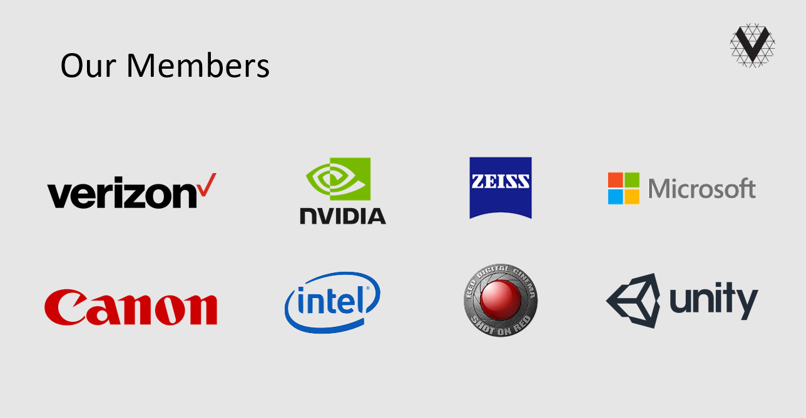

# Our Work
VFA is leading the way to a unified volumetric video ecosystem by defining a set of open specifications that encourage partnership and collaboration while reducing fragmentation for the entire industry.

## Membership
Our members are the titans of video capture, broadcast, and delivery.  With membership roles for Enterprises, Innovators, and Adopters, VFA has a place for all companies on the cutting edge of video technology. 

## The Purpose
To develop a volumetric ecosystem by bringing together companies from seven different verticals to work together to  establish a collection of specifications that will drive adoption of volumetric capture, processing, encoding, delivering and playback. 

### Unlock innovation and technology sharing
- Lead definition of a new bandwidth-intensive, industry format
- Avoid a fragmented ecosystem and accelerate launch of new products / services
- Leverage experts in each the vertical areas (e.g., capture, processing); reduce R&D spend
- Reduce friction for collaboration (utilize association working groups, bilateral agreements)
- Develop a set of specifications that allow for connections between each of the technical verticals to integrate with each other.   

<figure>
	
</figure>

## Why Volumetric Format  Association

**1. Technology is maturing -**
Consolidation continues to happen in the ventures space leading us to drive technologies that can be scaled for various consumer experiences.
  
**2. Unlock innovation and technology sharing -**
Enable a core foundation of companies in each of the verticals to share IP into the association
   
**3. Enable multi-industry ecosystem -**
Allow the core foundation of companies to work with each other through a common framework, without requiring bi-lateral contracts with each other
   
**4. Encourage product building -**
Allows for companies to begin to build technology components that they can each turn into new products / services. 

## Additional goals and benefits 
**Begins to bring the technologies together**
- A collection of technology specifications that work together
- Enable multi-industry ecosystem 
- Encourage product building 
- Keep costs/risk low
 
**Needs To** 
- Bring the content studios together with the device industry 
- Build global format to encourage adoption
- Educate businesses and consumers on volumetric content
- Avoid a format war

## The Key Membership Levels
**Founding Charter Member**
- Verizon - On the board directors
- Contributing encoding and delivery technology to the association

**Seven Founding Members** 
- On the board of directors
- Microsoft, Nvidia, Zeiss, Intel, Red Digital Cinema, Unity, Canon

### Organization Structure
<figure>
	
</figure>

## VFA Membership Level Benifits

<table>
  <caption>Membership Benefits</caption>
  <thead>
    <tr>
        <th></th>
        <th>Enterprise</th>
        <th>Innovator</th>
        <th>Adaptor</th>
        <th>Comments</th>
    </tr>
    <tr>
        <td>On BoD</td>
        <td>Yes</td>
        <td>No</td>
        <td>No</td>
        <td>-</td>
    </tr>
    <tr>
        <td>Can attend BOD meeetings</td>
        <td>Yes</td>
        <td>No</td>
        <td>No</td>
        <td>-</td>
    </tr>
    <tr>
        <td>On Technical Steering Committee</td>
        <td>Yes</td>
        <td>No</td>
        <td>No</td>
        <td>-</td>
    </tr>
    <tr>
        <td>Can propose new Working Groups</td>
        <td>Yes</td>
        <td>No</td>
        <td>No</td>
        <td>-</td>
    </tr>
    <tr>
        <td>Can Join Working Groups</td>
        <td>Yes</td>
        <td>Yes</td>
        <td>Invite Only via a BoD member</td>
        <td>-</td>
    </tr>
    <tr>
        <td>Can vote within Working Group</td>
        <td>Yes</td>
        <td>Yes</td>
        <td>No</td>
        <td>-</td>
    </tr>	  
    <tr>
        <td>Access to Draft Specifications</td>
        <td>Yes</td>
        <td>Yes</td>
        <td>No</td>
        <td>-</td>
    </tr>
    <tr>
        <tdAccess to Final Approved Specifications</td>
        <td>Yes</td>
        <td>Yes</td>
        <td>Yes</td>
        <td>-</td>
    </tr>
    <tr>
        <td>Can attend special session meetings</td>
        <td>Yes</td>
        <td>Yes</td>
        <td>Invite Only via a BOD member</td>
        <td>-</td>
    </tr>
    <tr>
        <td>Can attend quartely meetings</td>
        <td>Yes</td>
        <td>Yes</td>
        <td>Yes</td>
        <td>-</td>
    </tr>
  </tbody>
</table>

## Current Members
<figure>
	
</figure>
