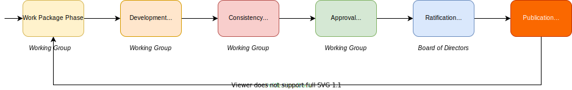
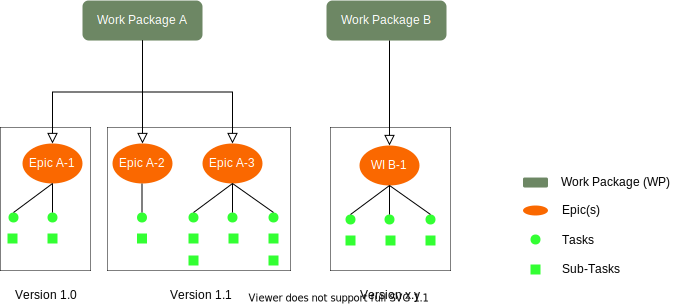
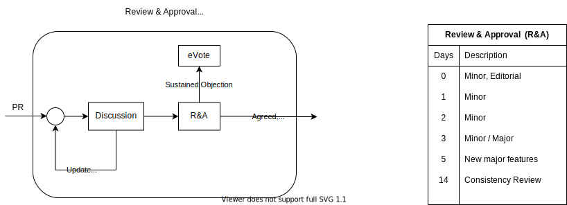

# Life Cycle of Technical Specifications
```
Note: Details to be added/updated after VFA Charter has been Approved
```
The diagram below represents a high level of the main phases for the development of Technical Specifications.

<figure>
	
	<figcaption>VFA Development Process</figcaption>
</figure>

<table>
  <caption>Technical Specifications Development Phases</caption>
  <thead>
    <tr>
	    <th>Phase</th>
	    <th>Description</th>
    </tr>
  </thead>
  <tbody>
    <tr>
	    <td><strong>Work Package</strong></td>
      <td>In this phase the group agrees the scope of the work to be developed. [Work Package template]()</br>
          Any member can provide a new Work Package proposal, the document is discussed among the group and further elaborated.
          The group will vote whether the Work Package is formally approved and endorsed by the majority of the group or rejected. </br>
          If the proposal is approved, the Work Package is moved to the next phase, <strong>Technical Development</strong>. </td>
    </tr>
    <tr>
	    <td><strong>Development</strong></td>
      <td>A Technical Specification MAY be composed of one or more documents:
        <ul>
          <li><strong>Requirements Document</strong>, (RD)</li>
            <ul><li>It contains the business requirements (not technical requirements). The business requirements are derived from the Use Cases described in the <strong>RD</strong> document. </li></ul>
          <li><strong>Architecture Document</strong>, (AD)</li>
            <ul><li>Document that describes all functional elements of the system and its interfaces or reference points.</li></ul>
          <li><strong>Technical Specification Document(s)</strong>, (TS)</li>
            <ul><li>It refers to a set of documented requirements to be satisfied by a material, design, product, or service. It helps to understand the configuration and architecture of a system. </li></ul>
          <li><strong>Supporting Document(s)</strong>, (SUP)</li>
            <ul><li>Contains profile data, metadata, schemas, etc.</li></ul>
        </ul>
        <strong>Note:</strong> in some cases the group MAY agree to develop a single document that contains the above list as sections.
        Each document will follow the phases described in this table:
      </td>
   </tr>
   <tr>
	    <td><strong>Consistency Review</strong></td>
	    <td>In this phase, the document(s) developed by the WG are formally reviewed by the group before proceeding to the next phase. Some WG hold meetings during which each statement in the document is read. Other WG open a review period of e.g. two weeks, to submit comments. At the end of the two weeks the WG review and resolve all the comments received before moving to the next phase.</td>
   </tr>
   <tr>
	    <td><strong>Working Group Approval</strong></td>
	    <td>In this phase, the document(s) developed by the WG are formally reviewed by the group. Once the WG completes the <strong>Consistency Review</strong> the document(s) MUST be agreed by the WG before sending the document(s) to the SC for formal <strong>Ratification</strong>.</td>
   </tr>
   <tr>
	    <td><strong>Steering Committee Ratification</strong></td>
	    <td>Once the document(s) are <strong>Reviewed</strong> and <strong>Agreed</strong> by the WG, the document(s) are sent to the SC for formal <strong>Ratification. </strong></td>
   </tr>   
   <tr>
	    <td><strong>Publication | Maintenance</strong></td>
	    <td>Upon Steering Committee <strong>Ratification</strong> the document(s) are ready for <strong>Publication</strong>.
      <ul>
        <li>To publish the document(s), the Maintainer will merge the "agreement" branch into the "publication" branch. 
        <li>At this point the Technical Specifications are publicly available for downloading.</li>
        <li>The WG SHOULD open a "dialogue" with the public via <strong>GitHub Issues</strong> and other forms of engagement. </li>
        <li>The input collected during the <strong>Maintenance</strong> phase SHOULD be used to improve the Technical Specifications as well as to collect business requirements for future releases.</li>
       </ul>
      </td>
   </tr>   
  </tbody>
</table>

# Documentation
Sematic Versioning 
<figure>
	
	<figcaption>Semantic Versioning</figcaption>
</figure>

<table>
  <caption>Document Version</caption>
  <thead>
    <tr>
	    <th>Field</th>
	    <th>Use</th>
	    <th>Description</th>
    </tr>
  </thead>
  <tbody>
  <tr>
    <td>X</td>
    <td><i>Major Version Indicator</i></td>
    <td>This mandatory field SHALL identify the major version of the document as determined by the WG.
      Major versions contain major feature additions; MAYcontain incompatibilities with previous document or specification revisions; and MAY change, drop, or replace existing interfaces. Initial releases are “1_0”.
    </td>
  </tr>
  <tr>
    <td>Y</td>
    <td><i>Minor Version Indicator</i></td>
    <td>Minor version of the document. This mandatory field SHALL identify the minor version of the document. It is incremented every time a minor change is made to the approved document version. Minor versions MAY contain minor feature additions, be compatible with the preceding Major_Minor specification revision, and MAY provide evolving interfaces. The initial minor release for any major release is “0”, i.e. 1_0</td>
   </tr>
   <tr>
    <td>Z</td>
    <td><i>Service Indicator</i></td>
    <td>Service indicator for the document. Incremented every time a corrective update is made to the <strong>Approved</strong> (not draft) document version by the WG.
    This field is OPTIONAL, and SHALL be provided whenever a service release of the document is made. The first service indicator release SHALL be “_1” for any Major_Minor release.
    Service indicators are intended to be compatible with the Major_Minor release they relate to but add bug fixes. No new functions will be added through the release of Service Indicators.
    </td>
  </tr>
  </tbody>
</table>

# VFA Process Flows

## Work Packages
* The Work Package (WP) SHALL describe the scope and expected deliverables and SHALL require WG approval
* WPs are breakdown into Epics. Epics are grouped in Technical Releases which are identified by a Release Version, [Semantic Versioning (vX.Y.Z)](https://semver.org/).
<figure>
	
	<figcaption>VFA Work Package Breakdown</figcaption>
</figure>

### Epics
* It could be a feature, customer request or business requirement.
* It is recommendable to define a list of Epics that will be formed the Release Version for the corresponding Work Package.
* The WG SHOULD define a placeholder for each Epic with few lines of description.
* The Epics can be further broken down into components that are not defined in the Work Package.

```This diagram breaksdown each phase into further detail:```
<figure>
	
	<figcaption>VFA Technical Specifications Development Phases</figcaption>
</figure>

## VFA Approval Process

In the Standards Development Organizations (SDOs), the majority's approval or rejection of a contribution follows a democratic process. This differs from an Open Source (OS) organization that generally follows a meritocratic process where the Maintainer decides what to accept or reject. In an OS project if a person doesn't like the decision that the contribution is rejected, then they can [_"fork"_](https://docs.github.com/en/free-pro-team@latest/github/getting-started-with-github/github-glossary#fork) the project. 
The goal for an SDO is to reach interoperability; therefore ["forking"](https://docs.github.com/en/free-pro-team@latest/github/getting-started-with-github/github-glossary#fork) is not the solution to a technical dispute. If there is a sustainable objection in a contribution, the resolution is via a vote.

<figure>
	
	<figcaption>VFA Approval Flow</figcaption>
</figure>

# Review & Approval Process

The Review & Approval process implies that all the contributions need to be accepted by the Working Group.

* **Content Submitted for Review**

  * It can be a Pull Request or an Issue. The group decides to extend the review period to facilitate input from people that will not be present at the meeting or give the group more time to review the content.

<figure>
	
	<figcaption>VFA Review and Approval Process</figcaption>
</figure>

* **Review period**:
    * Period of time during which the contribution will be under review before being merged.
      * The period can be: 0, 1, 2, 3, 5, 7, 14 days
      * 0 days imply that the contribution is merged without Working Group review

* **Comments or Objections**:
    * During the Review & Approval process members MAY raise comments or objections.
      * “Comments” MUST be taken in consideration by the Working Group, but they MAY be dismissed if the WG group thinks that they're not relevant.

      * “Objections” MUST be taken in consideration and they cannot be dismissed by the Working Group without being reviewed. 
      * If a contribution receives an “objection” the group MUST resolve the issue, with the person that raised the objection, before deciding the status of the contribution. If the “objection” is sustained, meaning the person doesn’t remove it, then the group will have to recur to a vote to resolve it.

* **Approval Criteria**:
    * A contribution is considered “approved” and therefore it can be merged if:
      * The contribution has not received any sustainable objection during the review period, AND
      * At least 3 reviewers have indicated that they agree with the contribution
    * If a sustained objection is received, the contribution cannot be merged, even if 3 or more contributors agreed with the contribution. 
    * If during the review period a contribution receives a comment, it is up to the group or maintainer to accept the comment or not. In any case, in order to merge the contribution at least 3 reviewers MUST indicate that they agree with the contribution.
