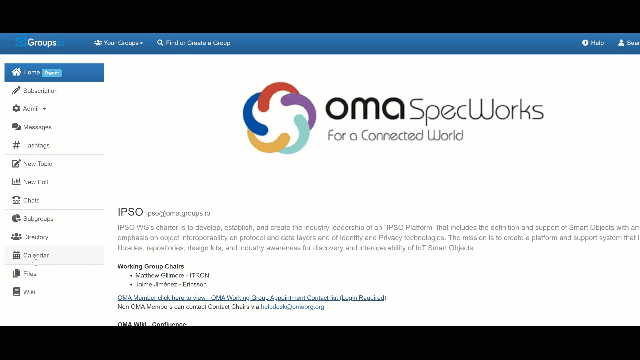

# Groups.io Resources

## Calendar
Groups.io provides a Calendar feature that members can use to view and create group events.
> Note: Group owners determine whether the Calendar feature is available in their groups and, if it is, who can view and create events: the general public (view only), all group members, or only group owners and moderators.

## Create Calendar Event

| Item      | Description |
| ----------- | ----------- |
| Event Name field| Enter the name of the event as it will be listed on the calendar. This field is required.|
| Date and Time panel | On this panel, you can change the date and timezone of the event and specify start and end times for the event|
| Repeats panel   | If the event is a repeating event, select the Event Repeats check box to display additional fields where you can select when and how often the event is repeated and when to end the repeating event.|
| Make This A Zoom Meeting button   | See [Making an event a Zoom meeting](https://groups.io/helpcenter/membersmanual/1/working-with-calendars/making-an-event-a-zoom-meeting) |
| Event Information panel   | Complete the desired fields (all are optional). |
| Reminders panel   | If desired, click the Add Reminder button to add one or more reminder notices that will be sent to the group before the event occurs. Click Add Reminder for each reminder you want to add.|
| Sent Notice To Group When Event Happens check box  | Select this check box if you want a message to be sent to the group automatically at the time the event occurs. The message will be tagged with the #cal-notice hashtag. |

## Download Calendar Event

Click in the date on which you want to add the event, or, at the bottom of the page, click the **Add Event** button.
> Note: If the button is not available to you (you cannot click it), the group’s owner allows only moderators to create calendar entries.
Complete the Event page:

